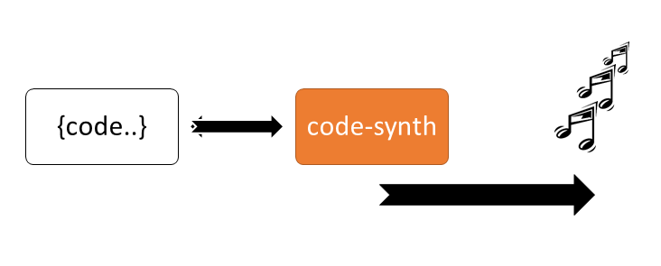

    

# code-synth 
## Dream Project
Reads Source Code and Produces Sound with that Code.

## Dream Project.

* Written Code is passed to code-synth and equivalent sound is produced.
* This is also an experiment to see how music corresponds to the given code.
* This project will also take my learnings from Digital Music Production from Berkley.

Sounds Clips need to be associated with  Either With Per Character or Per Word or Per Line.
Not sure but these are just thoughts.

